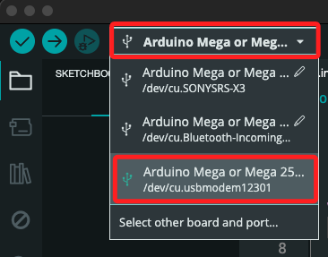
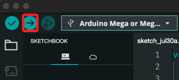
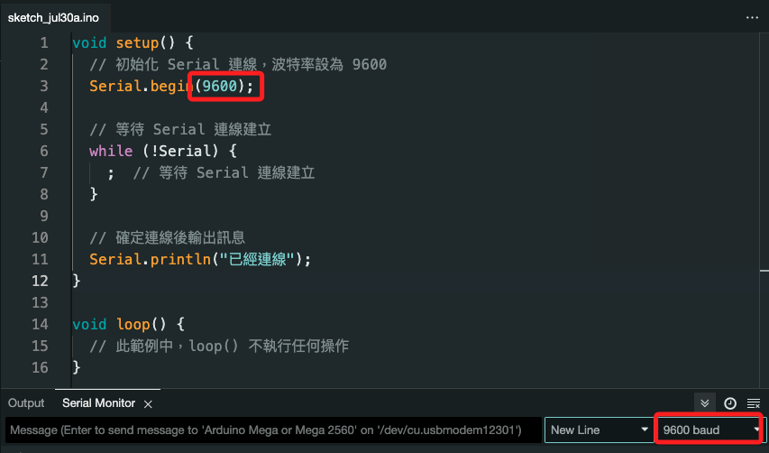
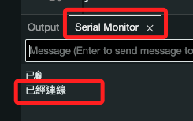

# 確認連線

## 基本操作

1. 選擇開發板



2. 開始上傳



3. 選擇 Baud rate



4. 在 Serial Monitor 查看輸出



## 腳本

1. 最基本的 Arduino 腳本，連接到 Arduino Mega2560 後，檢查 Serial 連線並輸出 `已經連線` 的訊息。

```cpp
void setup() {
  // 初始化 Serial 連線，波特率設為 9600
  Serial.begin(9600);

  // 等待 Serial 連線建立
  while (!Serial) {
    ;  // 等待 Serial 連線建立
  }

  // 確定連線後輸出訊息
  Serial.println("已經連線");
}

void loop() {
  // 此範例中，loop() 不執行任何操作
}
```

## 基本說明

1. 在 setup() 函數中初始化 Serial 連線，並設置波特率為 9600。

2. 使用 while 迴圈等待 Serial 連線建立。連線建立後，在 Serial 監視器中輸出 `已經連線` 的訊息。
