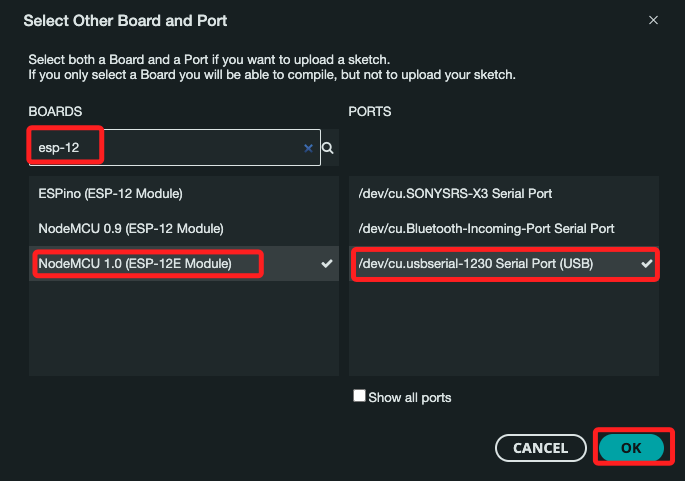
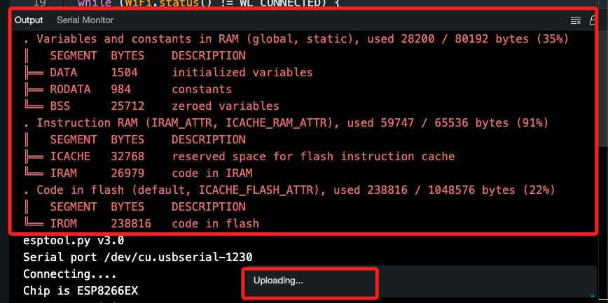
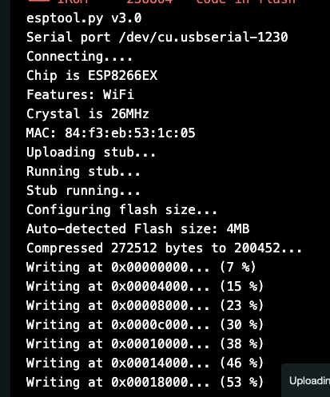

# LoLin new NodeMcu V3 開發板


## 安裝 ESP8266 庫

1. 打開 Arduino IDE，依次選擇 `文件 > 首選項`。

2. 在 附加開發板管理員網址 欄位中，輸入以下網址：
    ```
    http://arduino.esp8266.com/stable/package_esp8266com_index.json
    ```
3. 點擊 確定。
4. 依次選擇 工具 > 開發板 > 開發板管理員。
5. 搜尋 "ESP8266" 並安裝 esp8266 by ESP8266 Community。

### 2. 連接 LoLin NodeMcu V3 開發板
使用 Micro USB 線將 LoLin NodeMcu V3 開發板連接到電腦。

### 3. 配置 Arduino IDE

## 選擇開發板和端口

1. 依次選擇 `工具 > 開發板 > NodeMCU 1.0 (ESP-12E Module)`。

2. 在 `工具 > 端口` 中，選擇對應的端口，通常名稱會是 `/dev/ttyUSBx`。



3. 在 工具 > 上傳速度 中，選擇 `115200`。

## 編寫和上傳測試代碼

1. 上傳。



2. 上傳中。



3. 以下是一個簡單的測試代碼，連接到 Wi-Fi 並在 Serial 監視器中顯示 IP 地址：

```cpp
#include <ESP8266WiFi.h>

// 替換為你的 Wi-Fi SSID 和密碼
const char* ssid = "SamHome";
const char* password = "sam112233";

void setup() {
  // 初始化 Serial 連接，設置波特率
  Serial.begin(115200);
  delay(10);

  // 連接到 Wi-Fi
  Serial.println();
  Serial.print("Connecting to ");
  Serial.println(ssid);

  WiFi.begin(ssid, password);

  while (WiFi.status() != WL_CONNECTED) {
    delay(500);
    Serial.print(".");
  }

  // Wi-Fi 連接成功，顯示 IP 地址
  Serial.println("");
  Serial.println("WiFi connected");
  Serial.print("IP address: ");
  Serial.println(WiFi.localIP());
}

void loop() {
  // 此範例中，loop() 不執行任何操作
}
```

