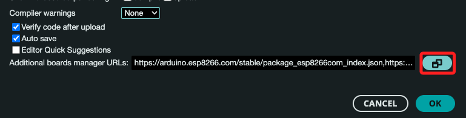
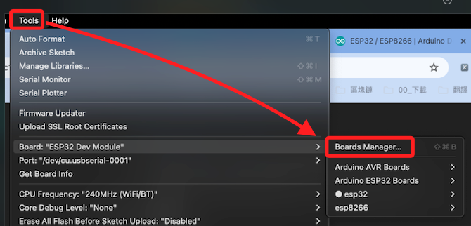

# ESP32

<br>

## 安裝 ESP32 庫

1. 打開 Arduino IDE。依次選擇 `Arduino IDE > Preferences`。

    

<br>

2. 點擊 `Additional boards manager URLs 附加開發板管理員網址` 欄位中點擊後方的編輯圖標。

    

<br>

3. 開啟編輯視窗，在下欄位中輸入網址，這兩個網址可以同時輸入，或是輸入其中一項。

    ```
    https://dl.espressif.com/dl/package_esp32_index.json
    https://dl.espressif.com/dl/package_esp32_index.json
    ```

<br>

4. 第一行短網址是 _來自 Espressif 官方網站的連接_，通常這個網址會指向穩定的版本；另一個是 `來自 Espressif 的 GitHub 存儲庫的連接`，這個網址可能會包含最新的開發版本，並且可能更頻繁地更新；可以同時輸入以便從兩個來源獲取更新和安裝包，Arduino IDE 會從這兩個網址中檢索所有可用的開發板和庫。

<br>

5. 依次選擇 `Tools 工具 > Board 開發板 > Boards Manager 開發板管理員`。

    

<br>

6. 搜尋 `ESP32`，IDE 會指引相關安裝與更新。

    

<br>

7. 下方 `Output` 視窗會顯示相關安裝資訊。

    

<br>

## 選擇開發板

1. 展開上方選單，點擊 `Select other board and port` 可以展開全部選項。

    

<br>

2. 選擇指定的開發板以及通訊埠。

    

<br>

3. 假如有合適選項，直接快速選取即可。

    

<br>

## 編寫和上傳代碼

1. 以下是一個簡單的測試代碼，特別注意，與 ESP12 不同，ESP32 使用的是 `<WiFi.h>`，連接到 Wi-Fi 後會在 Serial 監視器中顯示 IP 地址。

    ```cpp
    #include <WiFi.h>

    // 替換為自己的 Wi-Fi SSID 和密碼
    const char* ssid = "SamHome2.4g";
    const char* password = "sam112233";

    void setup() {
        // 初始化 Serial 連接，設置波特率
        Serial.begin(115200);
        delay(10);

        // 連接到 Wi-Fi
        Serial.println();
        Serial.print("Connecting to ");
        Serial.println(ssid);

        WiFi.begin(ssid, password);

        while (WiFi.status() != WL_CONNECTED) {
            delay(500);
            Serial.print(".");
        }

        // Wi-Fi 連接成功，顯示 IP 地址
        Serial.println("");
        Serial.println("WiFi connected");
        Serial.print("IP address: ");
        Serial.println(WiFi.localIP());
    }

    void loop() {
        // 此範例中，loop() 不執行任何操作
    }
    ```

<br>

___

_END_