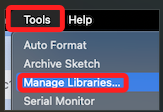
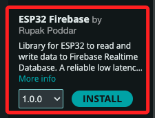
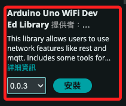
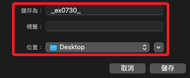
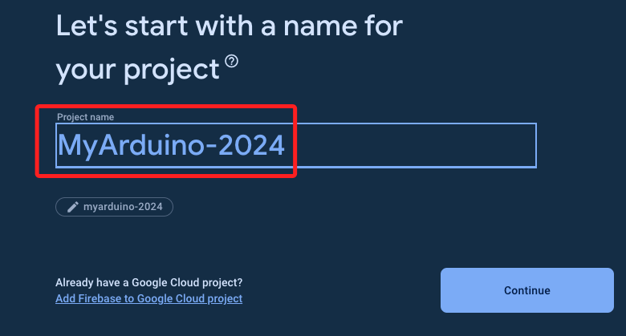
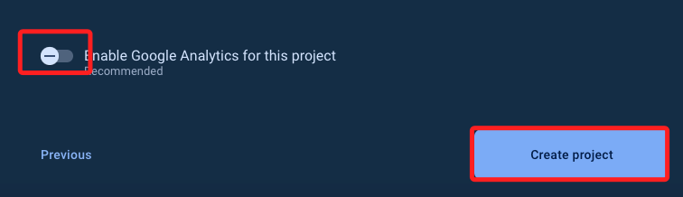

# 連線 Firebase Realtime Database

_使用 ESP32_

## 安裝必要的庫

1. 依次選擇 `Tools 工具 > Manage Libraries 庫管理員`。



2. 安裝 `Firebase ESP32`，可參考 [官方 GitHub](https://github.com/Rupakpoddar/ESP32Firebase)。



3. 安裝 `ArduinoJson`。


4. 安裝 `Arduino Uno WiFi Dev Ed Library`；這是我自己安裝的。



## 建立專案

1. 將專案儲存在桌面。



## 設置 Firebase

1. 進入 Console，建立新專案 `MyArduino-2024`。



2. 關閉，點擊 `Create`。



3. 完成，點擊 `Continue`。


4. 建立資料庫；操作暫時略過。

## 編輯腳本

1. 以下是一段將數據寫入 Firebase Realtime Database 的簡單範例，過程包含連線 WiFi、連線資料庫，然後寫入、讀取、刪除資料。

```cpp
    #include <WiFi.h>
    #include <ESP32Firebase.h>

    // 替換自己的 Wi-Fi SSID 和密碼
    #define _SSID "SamHome2.4g"
    #define _PASSWORD "sam112233"

    // 替換自己的 Firebase 資料庫 URL
    #define REFERENCE_URL "https://myarduino-2024-default-rtdb.firebaseio.com/"

    Firebase firebase(REFERENCE_URL);

    void setup() {
    Serial.begin(115200);

    WiFi.mode(WIFI_STA);
    WiFi.disconnect();
    delay(1000);

    // 連接到 WiFi
    Serial.println();
    Serial.println();
    Serial.print("Connecting to: ");
    Serial.println(_SSID);
    WiFi.begin(_SSID, _PASSWORD);

    // 正確連接
    while (WiFi.status() != WL_CONNECTED) {
        delay(500);
        Serial.print("-");
    }

    Serial.println("");
    Serial.println("WiFi Connected");

    // 列印 IP 地址
    Serial.print("IP Address: ");
    Serial.print("http://");
    Serial.print(WiFi.localIP());
    Serial.println("/");

    // 設置數據到 Firebase Realtime Database
    firebase.setString("Example/setString", "It's Working");
    firebase.setInt("Example/setInt", 123);
    firebase.setFloat("Example/setFloat", 45.32);

    // 推送數據到 Firebase Realtime Database
    firebase.pushString("push", "Hello");
    firebase.pushInt("push", 789);
    firebase.pushFloat("push", 89.54);

    // 獲取數據
    String data1 = firebase.getString("Example/setString");
    Serial.print("Received String:\t");
    Serial.println(data1);

    int data2 = firebase.getInt("Example/setInt");
    Serial.print("Received Int:\t\t");
    Serial.println(data2);

    float data3 = firebase.getFloat("Example/setFloat");
    Serial.print("Received Float:\t\t");
    Serial.println(data3);

    // 刪除數據
    firebase.deleteData("Example");
    }

    void loop() {
    // 此範例中，loop() 不執行任何操作
    }
```


## 加入監聽

1. 程式碼，要手動先建立監聽節點。

```cpp
#include <WiFi.h>
#include <ESP32Firebase.h>

// 替換為你的 Wi-Fi SSID 和密碼
#define _SSID "SamHome2.4g"
#define _PASSWORD "sam112233"

// 替換為你的 Firebase 資料庫 URL
#define REFERENCE_URL "https://myarduino-2024-default-rtdb.firebaseio.com/"

Firebase firebase(REFERENCE_URL);

String lastData = "";

void setup() {
  Serial.begin(115200);

  WiFi.mode(WIFI_STA); 
  WiFi.disconnect();
  delay(1000);

  // 連接到 WiFi
  Serial.println();
  Serial.println();
  Serial.print("Connecting to: ");
  Serial.println(_SSID);
  WiFi.begin(_SSID, _PASSWORD);

  while (WiFi.status() != WL_CONNECTED) {
    delay(500);
    Serial.print("-");
  }

  Serial.println("");
  Serial.println("WiFi Connected");

  // 打印 IP 地址
  Serial.print("IP Address: ");
  Serial.print("http://");
  Serial.print(WiFi.localIP());
  Serial.println("/");

  // 設置數據到 Firebase Realtime Database
  firebase.setString("Example/setString", "It's Working");
  firebase.setInt("Example/setInt", 123);
  firebase.setFloat("Example/setFloat", 45.32);

  // 推送數據到 Firebase Realtime Database
  firebase.pushString("push", "Hello");
  firebase.pushInt("push", 789);
  firebase.pushFloat("push", 89.54);

  // 獲取數據
  String data1 = firebase.getString("Example/setString");
  Serial.print("Received String:\t");
  Serial.println(data1);

  int data2 = firebase.getInt("Example/setInt");
  Serial.print("Received Int:\t\t");
  Serial.println(data2);

  float data3 = firebase.getFloat("Example/setFloat");
  Serial.print("Received Float:\t\t");
  Serial.println(data3);

  // 刪除數據
  firebase.deleteData("Example");
}

void loop() {
  // 定期檢查數據變化
  String newData = firebase.getString("Example/setString");
  if (newData != lastData) {
    Serial.print("Data changed: ");
    Serial.println(newData);
    lastData = newData;
  }
  delay(1000); // 每 1 秒檢查一次
}

```
## 優化監聽

1. 程式碼。
```cpp
#include <WiFi.h>
#include <ESP32Firebase.h>

// 替換為你的 Wi-Fi SSID 和密碼
#define _SSID "SamHome2.4g"
#define _PASSWORD "sam112233"

// 替換為你的 Firebase 資料庫 URL
#define REFERENCE_URL "https://myarduino-2024-default-rtdb.firebaseio.com/"

Firebase firebase(REFERENCE_URL);

// 保存前一個狀態的變數
String lastStringData = "";
int lastIntData = 0;
float lastFloatData = 0.0;

void setup() {
    Serial.begin(115200);

    WiFi.mode(WIFI_STA); 
    WiFi.disconnect();
    delay(1000);

    // 連接到 WiFi
    Serial.println();
    Serial.println();
    Serial.print("Connecting to: ");
    Serial.println(_SSID);
    WiFi.begin(_SSID, _PASSWORD);

    while (WiFi.status() != WL_CONNECTED) {
        delay(500);
        Serial.print("-");
    }

    Serial.println("");
    Serial.println("WiFi Connected");

    // 打印 IP 地址
    Serial.print("IP Address: ");
    Serial.print("http://");
    Serial.print(WiFi.localIP());
    Serial.println("/");

    // 設置數據到 Firebase Realtime Database
    firebase.setString("Example/setString", "It's Working");
    firebase.setInt("Example/setInt", 123);
    firebase.setFloat("Example/setFloat", 45.32);

    // 推送數據到 Firebase Realtime Database
    firebase.pushString("push", "Hello");
    firebase.pushInt("push", 789);
    firebase.pushFloat("push", 89.54);

    // 初次獲取數據
    lastStringData = firebase.getString("Example/setString");
    Serial.print("Initial String Data: ");
    Serial.println(lastStringData);

    lastIntData = firebase.getInt("Example/setInt");
    Serial.print("Initial Int Data: ");
    Serial.println(lastIntData);

    lastFloatData = firebase.getFloat("Example/setFloat");
    Serial.print("Initial Float Data: ");
    Serial.println(lastFloatData);
    }

    void loop() {
    // 檢查字串數據
    String newStringData = firebase.getString("Example/setString");
    if (newStringData != lastStringData) {
        Serial.print("String Data changed: ");
        Serial.println(newStringData);
        lastStringData = newStringData;
    }

    // 檢查整數數據
    int newIntData = firebase.getInt("Example/setInt");
    if (newIntData != lastIntData) {
        Serial.print("Int Data changed: ");
        Serial.println(newIntData);
        lastIntData = newIntData;
    }

    // 檢查浮點數數據
    float newFloatData = firebase.getFloat("Example/setFloat");
    if (newFloatData != lastFloatData) {
        Serial.print("Float Data changed: ");
        Serial.println(newFloatData);
        lastFloatData = newFloatData;
    }
    // 每 1 秒檢查一次
    delay(1000);
}
```
