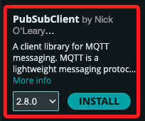
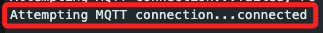
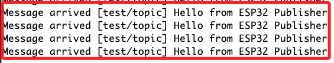

# MQTT

_使用兩台 ESP32 開發板進行 MQTT 通信的簡單腳本。一台 ESP32 發布消息，另一台 ESP32 訂閱並接收消息。_

<br>

## 準備工作

_在兩台 Arduino 開發版上安裝套件_

<br>

1. 安裝 `PubSubClient` 庫。

    

<br>

## 搭建 MQTT Broker

_這裡示範在另一台樹莓派上搭建 Broker_

<br>

1. 更新列表。

    ```bash
    sudo apt-get update
    ```

<br>

2. 安裝 Mosquitto Broker 和客戶端；這裡安裝客戶端是要用於測試使用。

    ```bash
    sudo apt-get install mosquitto mosquitto-clients
    ```

<br>

3. 設定文件。

    ```bash
    sudo nano /etc/mosquitto/mosquitto.conf
    ```

<br>

4. 編輯如下。

    ```bash
    pid_file /run/mosquitto/mosquitto.pid

    persistence true
    persistence_location /var/lib/mosquitto/

    log_dest file /var/log/mosquitto/mosquitto.log

    include_dir /etc/mosquitto/conf.d

    # 允許匿名訪問
    allow_anonymous true
    # 使 Mosquitto 在所有接口上監聽
    listener 1883 0.0.0.0
    ```

<br>

5. 啟動 Mosquitto Broker：Mosquitto 會自動作為服務啟動，並在每次開機後時自動運行，使用以下指令可手動啟動，如需停止請使用 `stop`，這裡不作示範。

    ```bash
    sudo systemctl start mosquitto
    sudo systemctl enable mosquitto
    ```

<br>

6. 檢查 Mosquitto 是否運行。

    ```bash
    sudo systemctl status mosquitto
    ```

<br>

7. 假如修正了設定文件，要重啟服務。

    ```bash
    sudo systemctl restart mosquitto
    ```

<br>

## 在樹莓派上測試

1. 確認樹莓派 IP，例如結果是 `192.168.1.134`。

    ```bash
    hostname -I
    ```

<br>

2. 開啟一個終端運行以下指令進行訂閱。

    ```bash
    mosquitto_sub -h 192.168.1.134 -t test/topic
    ```

<br>

3. 在另一個終端機上進行發布。

    ```bash
    mosquitto_pub -h 192.168.1.134 -t test/topic -m "Hello from terminal"
    ```

<br>

## 高級配置 Mosquitto

_以上測試已經可以正常使用，如果需要更高級的配置，如啟用密碼保護，可以編輯配置文件_

<br>

1. 編輯 Mosquitto 配置文件。

    ```bash
    sudo nano /etc/mosquitto/mosquitto.conf
    ```

<br>

2. 添加以下配置進行密碼保護。

    ```
    allow_anonymous false
    password_file /etc/mosquitto/passwd
    ```

<br>

3. 建立密碼文件並添加用戶。

    ```bash
    sudo mosquitto_passwd -c /etc/mosquitto/passwd YOUR_USERNAME
    ```

<br>

4. 重啟 Mosquitto。

    ```bash
    sudo systemctl restart mosquitto
    ```

<br>

## 在 ESP32 上配置 MQTT 連接

1. 發布消息。

    ```cpp
    #include <WiFi.h>
    #include <PubSubClient.h>

    // 替換為你的 Wi-Fi SSID 和密碼
    const char* ssid = "SamHome2.4g";
    const char* password = "sam112233";

    // 替換為你的樹莓派 IP 地址
    const char* mqtt_server = "192.168.1.134";
    const int mqtt_port = 1883;

    WiFiClient espClient;
    PubSubClient client(espClient);

    void setup() {
        Serial.begin(115200);
        setup_wifi();
        client.setServer(mqtt_server, mqtt_port);
    }

    void setup_wifi() {
        delay(10);
        Serial.println();
        Serial.print("Connecting to ");
        Serial.println(ssid);

        WiFi.begin(ssid, password);

        while (WiFi.status() != WL_CONNECTED) {
            delay(500);
            Serial.print(".");
        }

        Serial.println("");
        Serial.println("WiFi connected");
        Serial.println("IP address: ");
        Serial.println(WiFi.localIP());
    }

    void reconnect() {
        while (!client.connected()) {
            Serial.print("Attempting MQTT connection...");
            if (client.connect("ESP32Publisher")) {
            Serial.println("connected");
            } else {
            Serial.print("failed, rc=");
            Serial.print(client.state());
            Serial.println(" try again in 5 seconds");
            delay(5000);
            }
        }
    }

    void loop() {
        if (!client.connected()) {
            reconnect();
    }
    client.loop();

    // 發布消息到 "test/topic"
    client.publish("test/topic", "Hello from ESP32 Publisher");
    // 每2秒發布一次消息
    delay(2000);
    }
    ```

    

<br>

2. 發布並加上計次。

    ```cpp
    // 其餘不變 ...
    // 宣告一個計次變數，實務上可使用 long
    int message_count = 0


    // 在 client loop() 之後進行累加
    message_count++;

    // 接著透過累加的數值建立組合訊息：將數值轉換為字串
    String message = "Hello & Count：" + String(message);

    // 將新的訊息進行發布
    client.publish("test/topic", messag.c_str());
    // 其餘不變 ...
    ```

<br>

3. 訂閱消息。

    ```cpp
    #include <WiFi.h>
    #include <PubSubClient.h>

    // 替換為你的 Wi-Fi SSID 和密碼
    const char* ssid = "SamHome2.4g";
    const char* password = "sam112233";

    // 替換為你的樹莓派 IP 地址
    const char* mqtt_server = "192.168.1.134";
    const int mqtt_port = 1883;

    WiFiClient espClient;
    PubSubClient client(espClient);

    void callback(char* topic, byte* payload, unsigned int length) {
        Serial.print("Message arrived [");
        Serial.print(topic);
        Serial.print("] ");
        for (unsigned int i = 0; i < length; i++) {
            Serial.print((char)payload[i]);
        }
        Serial.println();
    }

    void setup() {
        Serial.begin(115200);
        setup_wifi();
        client.setServer(mqtt_server, mqtt_port);
        client.setCallback(callback);
    }

    void setup_wifi() {
        delay(10);
        Serial.println();
        Serial.print("Connecting to ");
        Serial.println(ssid);

        WiFi.begin(ssid, password);

        while (WiFi.status() != WL_CONNECTED) {
            delay(500);
            Serial.print(".");
        }

        Serial.println("");
        Serial.println("WiFi connected");
        Serial.println("IP address: ");
        Serial.println(WiFi.localIP());
    }

    void reconnect() {
        while (!client.connected()) {
            Serial.print("Attempting MQTT connection...");
            if (client.connect("ESP32Subscriber")) {
            Serial.println("connected");
            // 訂閱主題 "test/topic"
            client.subscribe("test/topic");
            } else {
            Serial.print("failed, rc=");
            Serial.print(client.state());
            Serial.println(" try again in 5 seconds");
            delay(5000);
            }
        }
    }

    void loop() {
        if (!client.connected()) {
            reconnect();ㄉ
        }
        client.loop();
        }
    ```

    

<br>

___

_END_
