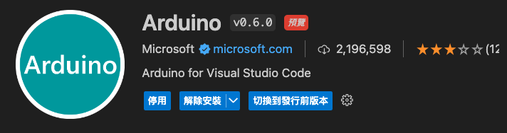

# 使用 VSCode

<br>

## 安裝 Arduino 擴展

1. 安裝拓展 `Arduino`。

    

<br>

2. 安裝拓展 `PlatformIO`：PlatformIO 是一個強大的工具，可以用於多種嵌入式開發平台，包括 Arduino。

    

<br>

## 配置 PlatformIO

1. 點擊左側 PlatformIO 圖標，初次啟動會安裝。

    

<br>

2. 選擇 `Create New Project` 建立一個新的 PlatformIO 項目；輸入項目名稱 `_ex0730_`，選擇開發板 `ESP32 Dev Module`，選擇框架 `Arduino`），然後使用預設的 `location`；完成後點擊右下角的 `Finish`。

    

<br>

## 編寫 Arduino 程式碼

1. 在 PlatformIO 項目中，打開 `src` 文件夾中的 `main.cpp` 文件。

    

<br>

2. 編寫 Arduino 程式碼。

    ```cpp
    #include <Arduino.h>

    void setup() {
        // 初始化串行通信，設置波特率為 115200
        Serial.begin(115200);
        // 等待串行通信初始化完成
        while (!Serial) {
            ; // 等待串行通信連接
        }
        // 在串行控制台上輸出啟動消息
        Serial.println("Arduino SUCCESS！");
    }

    void loop() {
        // 每隔1秒輸出一次消息
        Serial.println("This is TEST。");
        delay(1000);  // 延遲1秒
    }
    ```

<br>

## 編譯和上傳程式碼

1. 將 Arduino 開發板通過 USB 連接到電腦。

<br>

2. 在 VSCode 中打開命令面板（`control + SHIFT + P`），輸入 `PlatformIO: Build` 編譯程式碼。

    

<br>

3. 完成時顯示。

    

<br>

4. 再次打開命令面板輸入 `PlatformIO: Upload and Monitor` 將程式碼上傳到開發板。

    

<br>

## 打開 Serial 監視器

1. 在前一個步驟中，假如僅上傳 `PlatformIO: Upload`，接下來可以選擇 `PlatformIO: Monitor` 打開 Serial 監視器。

<br>

___

_END_

