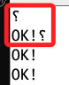

# Serial Monitor

_CR 和 NL & CR 等設置_


<br>

1. No line ending (無行結束)：按下 `ENTER` 時，不會發送任何行結束字元。

<br>

2. Newline (NL)：按下 `ENTER` 時，只會發送一個新行字元（LF，Line Feed）；`LF` 的意思是 `換行`，這是一個 `控制字元`，用於指示文本中的下一個字元應該顯示在下一行，對應的 ASCII 編碼是 `\n（10）`。

<br>

3. Carriage Return (CR)：按下 `ENTER` 時，只會發送一個 `ENTER` 字元（CR，Carriage Return），對應 ASCII 編碼為 `\r`（13）。

<br>

4. Both NL & CR (NL & CR)：按下 `ENTER` 鍵時，會同時發送 `NL` 和 `ENTER` 字元，對應 ASCII 編碼為 `\r\n`（13 和 10）。

<br>

## Serial Port 亂碼解決方案



_類似的這些亂碼或符號 `⸮` 通常是由於串行通信初始化過程中的波特率不匹配引起的，這包含串行端口尚未準備好就進行的串接而導致顯示出錯亂的字元。_

<br>

1. 確認 `Baud Rate 波特率` 匹配：確保 Arduino 代碼和串行監視器中設置的波特率是一致的。

<br>

2. 可嘗試在 `setup()` 中加入延遲以確保串行端口有足夠的時間初始化。

    ```cpp
    void setup() {
        // 初始化串行通信並設置波特率
        Serial.begin(115200);
        
        // 給串行監視器一些時間進行初始化
        delay(1000);

        // 等待串行端口準備好
        while(!Serial){
            delay(50);
        }
        
        // 測試
        Serial.print("\nOK!");
    }

    void loop() {
    //
    }
    ```

<br>

___

_END_