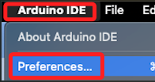
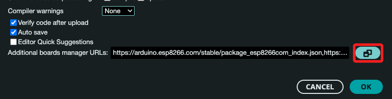
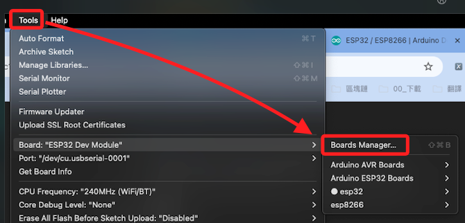
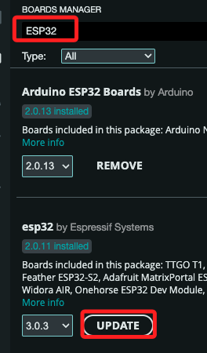
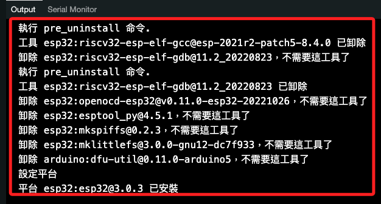
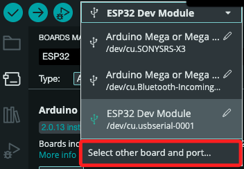
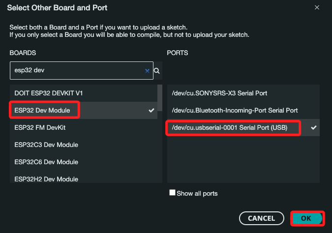
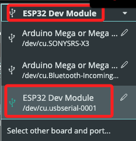
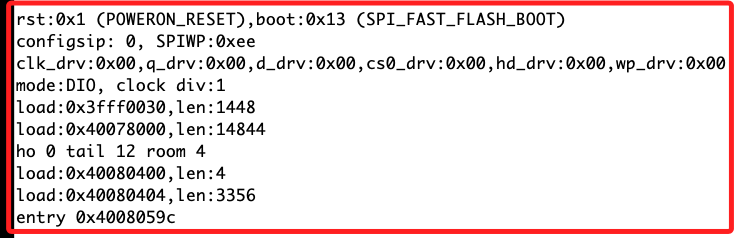

# ESP32

<br>

## 安裝 ESP32 庫

1. 打開 Arduino IDE。依次選擇 `Arduino IDE > Preferences`。

    

<br>

2. 點擊 `Additional boards manager URLs 附加開發板管理員網址` 欄位中點擊後方的編輯圖標。

    

<br>

3. 開啟編輯視窗，在下欄位中輸入網址，這兩個網址可以同時輸入，或是輸入其中一項。

    ```
    https://dl.espressif.com/dl/package_esp32_index.json
    https://raw.githubusercontent.com/espressif/arduino-esp32/gh-pages/package_esp32_index.json
    ```

<br>

4. 第一行短網址是 _來自 Espressif 官方網站的連接_，通常這個網址會指向穩定的版本；另一個是 `來自 Espressif 的 GitHub 存儲庫的連接`，這個網址可能會包含最新的開發版本，並且可能更頻繁地更新；可以同時輸入以便從兩個來源獲取更新和安裝包，Arduino IDE 會從這兩個網址中檢索所有可用的開發板和庫。

<br>

5. 依次選擇 `Tools 工具 > Board 開發板 > Boards Manager 開發板管理員`。

    

<br>

6. 搜尋 `ESP32`，IDE 會指引相關安裝與更新。

    

<br>

7. 下方 `Output` 視窗會顯示相關安裝資訊。

    

<br>

## 選擇開發板

1. 展開上方選單，點擊 `Select other board and port` 可以展開全部選項。

    

<br>

2. 選擇指定的開發板以及通訊埠。

    

<br>

3. 假如有合適選項，直接快速選取即可。

    

<br>

## 編寫和上傳程式碼

1. 以下是一個簡單的測試程式碼，特別注意，與 ESP12 不同，ESP32 使用的是 `<WiFi.h>`，連接到 Wi-Fi 後會在 Serial 監視器中顯示 IP 地址。

    ```cpp
    #include <WiFi.h>

    // 替換為自己的 Wi-Fi SSID 和密碼
    const char* ssid = "SamHome2.4g";
    const char* password = "sam112233";

    void setup() {
        // 初始化 Serial 連接，設置波特率
        Serial.begin(115200);
        delay(10);

        // 連接到 Wi-Fi
        Serial.println();
        Serial.print("Connecting to ");
        Serial.println(ssid);

        WiFi.begin(ssid, password);

        while (WiFi.status() != WL_CONNECTED) {
            delay(500);
            Serial.print(".");
        }

        // Wi-Fi 連接成功，顯示 IP 地址
        Serial.println("");
        Serial.println("WiFi connected");
        Serial.print("IP address: ");
        Serial.println(WiFi.localIP());
    }

    void loop() {
        // 此範例中，loop() 不執行任何操作
    }
    ```

<br>

## 關於啟動時的訊息

1. 每次燒錄時會出現如下訊息，這是來自於 ESP32 啟動過程自動輸出的啟動信息（boot log）。

    

<br>

2. 這些信息主要包括以下內容。

    1) 復位原因：`rst:0x1 (POWERON_RESET)` 表示系統是由於電源上電復位而啟動的。

    2) 啟動模式：`boot:0x13 (SPI_FAST_FLASH_BOOT)` 表示使用 SPI 閃存的快速啟動模式。

    3) 配置和驅動設置：如 `configsip`、`SPIWP`、`clk_drv` 等，這些都是 ESP32 啟動時配置的硬件設置。

    4) 內存加載：ESP32 啟動過程中加載的不同內存區塊，如 `load:0x3fff0030,len:1448` 等。

    5) 入口點：`entry 0x4008059c` 表示程序開始執行的入口地址。

<br>

3. 特別注意，這些訊息是 ESP32 固件自帶的輸出，雖然使用延遲可避免在燒錄時出現，但按下復位 `RST` 時，依舊會先看到這些 LOG 訊息的。

    ```cpp
    void setup() {
    // 延遲2秒，等待啟動訊息結束
    delay(2000); 
    Serial.begin(115200);
    
    while(!Serial){
        delay(50);
    }
    
    Serial.print("\nSTART..0809");
    }

    void loop() {
    //
    }
    ```

<br>

___

_END_