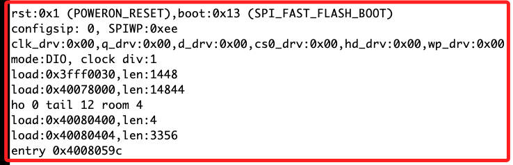

# 關於啟動時的訊息

<br>

1. 每次燒錄時會出現如下訊息，這是來自於 ESP32 啟動過程自動輸出的啟動信息（boot log）。

    

<br>

2. 這些信息主要包括以下內容。

    1) 復位原因：`rst:0x1 (POWERON_RESET)` 表示系統是由於電源上電復位而啟動的。

    2) 啟動模式：`boot:0x13 (SPI_FAST_FLASH_BOOT)` 表示使用 SPI 閃存的快速啟動模式。

    3) 配置和驅動設置：如 `configsip`、`SPIWP`、`clk_drv` 等，這些都是 ESP32 啟動時配置的硬件設置。

    4) 內存加載：ESP32 啟動過程中加載的不同內存區塊，如 `load:0x3fff0030,len:1448` 等。

    5) 入口點：`entry 0x4008059c` 表示程序開始執行的入口地址。

<br>

3. 特別注意，這些訊息是 ESP32 固件自帶的輸出，雖然使用延遲可避免在燒錄時出現，但按下復位 `RST` 時，依舊會先看到這些 LOG 訊息的。

    ```cpp
    void setup() {
        // 延遲2秒，等待啟動訊息結束
        delay(2000); 
        // 啟動通訊
        Serial.begin(115200);
        // 確認連線
        while(!Serial){
            delay(50);
        }
        // 輸出
        Serial.print("\nSTART..0809");
    }

    void loop() {
        // 無
    }
    ```

<br>

___

_END_