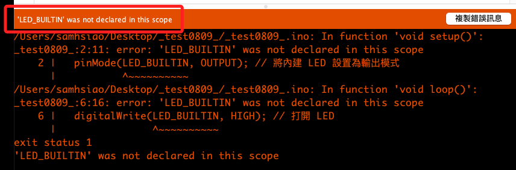

# 內建 LED

_假如是有內建 LED 的型號，也可進行測試_

<br>

## 說明

1. ESP32 開發板內建 LED 連接在 Pin 腳 `GPIO2`，但具體可能會因為不同廠牌的開發板而有所不同，同樣可使用 `LED_BUILTIN` 來引用內建的 LED；特別注意，並非全部的 ESP32 開發板都有內建 LED。

    ```cpp
    void setup() {
        // 將內建 LED 設置為輸出模式
        pinMode(LED_BUILTIN, OUTPUT);
    }

    void loop() {
      digitalWrite(LED_BUILTIN, HIGH); // 打開 LED
      delay(1000);                     // 等待 1 秒
      digitalWrite(LED_BUILTIN, LOW);  // 關閉 LED
      delay(1000);                     // 等待 1 秒
    }
    ```

<br>

2. 在某些內建 LED 的開發板中，LED_BUILTIN 並沒有被預設定義，運行會出現以下錯誤。

    

<br>

3. 若出現 `Unable to verify flash chip connection (Invalid head of packet (0x40): Possible serial noise or corruption.)` 之類的訊息，代表在上傳過程中可能存在串行干擾或其他造成數據損壞的情況，此時代表代碼以編譯，僅需嘗試排除硬體問題。

```bash
A fatal error occurred: Unable to verify flash chip connection (Invalid head of packet (0x40): Possible serial noise or corruption.).
A fatal error occurred: Unable to verify flash chip connection (Invalid head of packet (0x40): Possible serial noise or corruption.).
```

<br>

___

_待續_