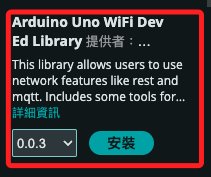

# 連線 Firebase Realtime Database

_使用 ESP32_

<br>

## 安裝必要的庫

1. 依次選擇 `Tools 工具 > Manage Libraries 庫管理員`。

    

<br>

2. 安裝 `Firebase ESP32`，可參考 [官方 GitHub](https://github.com/Rupakpoddar/ESP32Firebase)。

    

<br>

3. 安裝 `ArduinoJson`。

    

<br>

4. 安裝 `Arduino Uno WiFi Dev Ed Library`；這是我自己安裝的。

    

<br>

## 建立專案

1. 將專案儲存在桌面。

    

<br>

## 設置 Firebase

1. 進入 Console，建立新專案 `MyArduino-2024`。

    

<br>

2. 關閉，點擊 `Create`。

    

<br>

3. 完成，點擊 `Continue`。

    

<br>

4. 建立資料庫；操作暫時略過。

<br>

## 編輯腳本

1. 以下是一段將數據寫入 Firebase Realtime Database 的簡單範例，過程包含連線 WiFi、連線資料庫，然後寫入、讀取、刪除資料。

    ```cpp
    #include <WiFi.h>
    #include <ESP32Firebase.h>

    // 替換自己的 Wi-Fi SSID 和密碼
    #define _SSID "SamHome2.4g"
    #define _PASSWORD "sam112233"

    // 替換自己的 Firebase 資料庫 URL
    #define REFERENCE_URL "https://myarduino-2024-default-rtdb.firebaseio.com/"

    Firebase firebase(REFERENCE_URL);

    void setup() {
        Serial.begin(115200);

        WiFi.mode(WIFI_STA);
        WiFi.disconnect();
        delay(1000);

        // 連接到 WiFi
        Serial.println();
        Serial.println();
        Serial.print("Connecting to: ");
        Serial.println(_SSID);
        WiFi.begin(_SSID, _PASSWORD);

        // 正確連接
        while (WiFi.status() != WL_CONNECTED) {
            delay(500);
            Serial.print("-");
        }

        Serial.println("");
        Serial.println("WiFi Connected");

        // 列印 IP 地址
        Serial.print("IP Address: ");
        Serial.print("http://");
        Serial.print(WiFi.localIP());
        Serial.println("/");

        // 設置數據到 Firebase Realtime Database
        firebase.setString("Example/setString", "It's Working");
        firebase.setInt("Example/setInt", 123);
        firebase.setFloat("Example/setFloat", 45.32);

        // 推送數據到 Firebase Realtime Database
        firebase.pushString("push", "Hello");
        firebase.pushInt("push", 789);
        firebase.pushFloat("push", 89.54);

        // 獲取數據
        String data1 = firebase.getString("Example/setString");
        Serial.print("Received String:\t");
        Serial.println(data1);

        int data2 = firebase.getInt("Example/setInt");
        Serial.print("Received Int:\t\t");
        Serial.println(data2);

        float data3 = firebase.getFloat("Example/setFloat");
        Serial.print("Received Float:\t\t");
        Serial.println(data3);

        // 刪除數據
        firebase.deleteData("Example");
    }

    void loop() {
        // 此範例中，loop() 不執行任何操作
    }
    ```

<br>

## 加入監聽

1. 程式碼，要手動先建立監聽節點。

    ```cpp
    #include <WiFi.h>
    #include <ESP32Firebase.h>

    // 替換為自己的 Wi-Fi SSID 和密碼
    #define _SSID "SamHome2.4g"
    #define _PASSWORD "sam112233"

    // 替換為自己的 Firebase 資料庫 URL
    #define REFERENCE_URL "https://myarduino-2024-default-rtdb.firebaseio.com/"

    Firebase firebase(REFERENCE_URL);

    String lastData = "";

    void setup() {
        Serial.begin(115200);

        WiFi.mode(WIFI_STA); 
        WiFi.disconnect();
        delay(1000);

        // 連接到 WiFi
        Serial.println();
        Serial.println();
        Serial.print("Connecting to: ");
        Serial.println(_SSID);
        WiFi.begin(_SSID, _PASSWORD);

        while (WiFi.status() != WL_CONNECTED) {
            delay(500);
            Serial.print("-");
        }

        Serial.println("");
        Serial.println("WiFi Connected");

        // 打印 IP 地址
        Serial.print("IP Address: ");
        Serial.print("http://");
        Serial.print(WiFi.localIP());
        Serial.println("/");

        // 設置數據到 Firebase Realtime Database
        firebase.setString("Example/setString", "It's Working");
        firebase.setInt("Example/setInt", 123);
        firebase.setFloat("Example/setFloat", 45.32);

        // 推送數據到 Firebase Realtime Database
        firebase.pushString("push", "Hello");
        firebase.pushInt("push", 789);
        firebase.pushFloat("push", 89.54);

        // 獲取數據
        String data1 = firebase.getString("Example/setString");
        Serial.print("Received String:\t");
        Serial.println(data1);

        int data2 = firebase.getInt("Example/setInt");
        Serial.print("Received Int:\t\t");
        Serial.println(data2);

        float data3 = firebase.getFloat("Example/setFloat");
        Serial.print("Received Float:\t\t");
        Serial.println(data3);

        // 刪除數據
        firebase.deleteData("Example");
    }

    void loop() {
        // 定期檢查數據變化
        String newData = firebase.getString("Example/setString");
        if (newData != lastData) {
            Serial.print("Data changed: ");
            Serial.println(newData);
            lastData = newData;
        }
        // 每 1 秒檢查一次
        delay(1000);
    }
    ```

<br>

## 優化監聽

1. 程式碼。

    ```cpp
    #include <WiFi.h>
    #include <ESP32Firebase.h>

    // 替換為你的 Wi-Fi SSID 和密碼
    #define _SSID "SamHome2.4g"
    #define _PASSWORD "sam112233"

    // 替換為你的 Firebase 資料庫 URL
    #define REFERENCE_URL "https://myarduino-2024-default-rtdb.firebaseio.com/"

    Firebase firebase(REFERENCE_URL);

    // 保存前一個狀態的變數
    String lastStringData = "";
    int lastIntData = 0;
    float lastFloatData = 0.0;

    void setup() {
        Serial.begin(115200);

        WiFi.mode(WIFI_STA); 
        WiFi.disconnect();
        delay(1000);

        // 連接到 WiFi
        Serial.println();
        Serial.println();
        Serial.print("Connecting to: ");
        Serial.println(_SSID);
        WiFi.begin(_SSID, _PASSWORD);

        while (WiFi.status() != WL_CONNECTED) {
            delay(500);
            Serial.print("-");
        }

        Serial.println("");
        Serial.println("WiFi Connected");

        // 打印 IP 地址
        Serial.print("IP Address: ");
        Serial.print("http://");
        Serial.print(WiFi.localIP());
        Serial.println("/");

        // 設置數據到 Firebase Realtime Database
        firebase.setString("Example/setString", "It's Working");
        firebase.setInt("Example/setInt", 123);
        firebase.setFloat("Example/setFloat", 45.32);

        // 推送數據到 Firebase Realtime Database
        firebase.pushString("push", "Hello");
        firebase.pushInt("push", 789);
        firebase.pushFloat("push", 89.54);

        // 初次獲取數據
        lastStringData = firebase.getString("Example/setString");
        Serial.print("Initial String Data: ");
        Serial.println(lastStringData);

        lastIntData = firebase.getInt("Example/setInt");
        Serial.print("Initial Int Data: ");
        Serial.println(lastIntData);

        lastFloatData = firebase.getFloat("Example/setFloat");
        Serial.print("Initial Float Data: ");
        Serial.println(lastFloatData);
        }

        void loop() {
        // 檢查字串數據
        String newStringData = firebase.getString("Example/setString");
        if (newStringData != lastStringData) {
            Serial.print("String Data changed: ");
            Serial.println(newStringData);
            lastStringData = newStringData;
        }

        // 檢查整數數據
        int newIntData = firebase.getInt("Example/setInt");
        if (newIntData != lastIntData) {
            Serial.print("Int Data changed: ");
            Serial.println(newIntData);
            lastIntData = newIntData;
        }

        // 檢查浮點數數據
        float newFloatData = firebase.getFloat("Example/setFloat");
        if (newFloatData != lastFloatData) {
            Serial.print("Float Data changed: ");
            Serial.println(newFloatData);
            lastFloatData = newFloatData;
        }
        // 每 1 秒檢查一次
        delay(1000);
    }
    ```

<br>

___

_END_