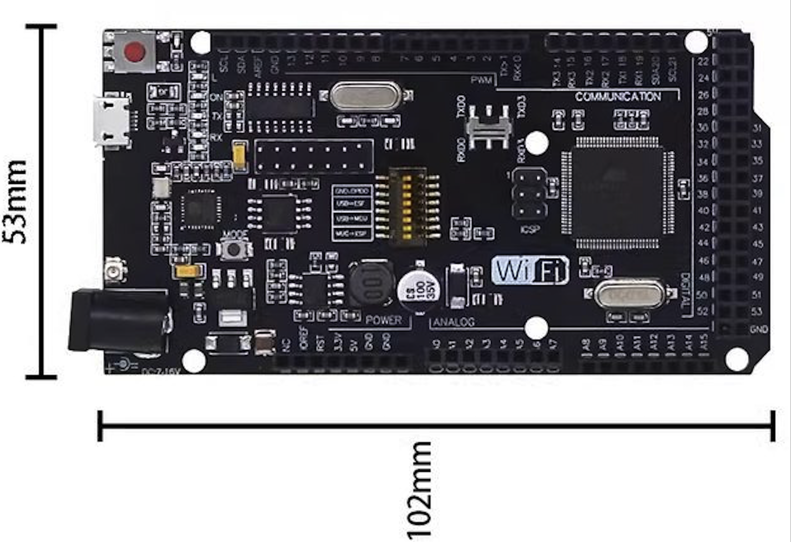
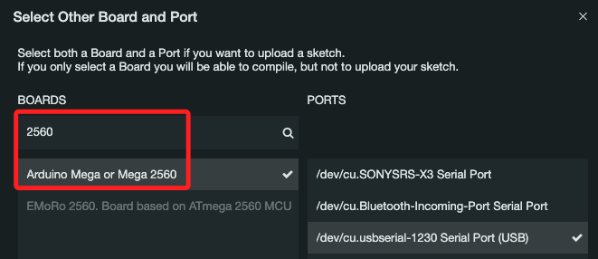

# ARDUINO COMPATIBLE - ATMEGA2560 WIFI W/ESP8266 32MB + ANTENNA

_結合了 ATmega2560 和 ESP8266 的開發板_

## 說明

1. 擁有 Arduino Mega 的所有 I/O 接口、32MB 的閃存。

2. 開發板上配置了 ATmega2560 及 ESP8266 兩個微控制器，通過串行接口實現通信，使用 AT指令控制 ESP8266 連接到網路。

3. 使用 IDE 時選擇要分別選擇並燒入。

