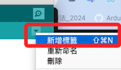
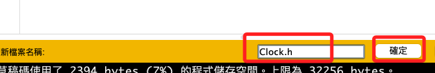
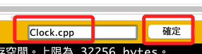

# 物件導向的實現

_在 Arduino IDE 中使用 .cpp 文件和頭文件_

<br>

## 步驟簡介

1. 建立頭文件 (`Clock.h`)：這個文件包含類的聲明。

<br>

2. 建立源文件 (`Clock.cpp`)：這個文件包含類的實現。

<br>

3. 建立主腳本 (`.ino` 文件)：這個文件包含 `setup()` 和 `loop()` 函數，並且導入頭文件。

<br>

## 步驟實作

1. 在 IDE 中點擊右上角的 `新增標籤` 建立新的標頭文件。

    

<br>

2. 命名為 `Clock.h`，點擊 `確定`。

    

<br>

3. 接著先新增 `同名` 的源文件 (`Clock.cpp`)，步驟與前面相同；特別說明，這裡緊接著新增的源文件採用同名只是一個 C++ 程式撰寫的習慣，讓代碼易於理解和維護，並非強制規定。

    

<br>

4. 先編輯 `頭文件`。

    ```cpp
    #ifndef CLOCK_H
    #define CLOCK_H

    #include <Arduino.h>

    class Clock {
    public:
        Clock();
        void update(unsigned long currentMillis, unsigned long interval);
        void display();

    private:
        unsigned long previousMillis;
        int seconds;
        int minutes;
        int hours;
        int days;
    };

    #endif // CLOCK_H
    ```

<br>

5. 編輯源文件 (`Clock.cpp`)。

    ```cpp
    #include "Clock.h"

    Clock::Clock() {
        previousMillis = 0;
        seconds = 0;
        minutes = 0;
        hours = 0;
        days = 0;
    }

    void Clock::update(unsigned long currentMillis, unsigned long interval) {
        if (currentMillis - previousMillis >= interval) {
            previousMillis = currentMillis;
            seconds++;

            if (seconds >= 60) {
                seconds = 0;
                minutes++;
            }

            if (minutes >= 60) {
                minutes = 0;
                hours++;
            }

            if (hours >= 24) {
                hours = 0;
                days++;
            }
        }
    }

    void Clock::display() {
        Serial.print("Time: ");
        Serial.print(days);
        Serial.print(" days ");
        Serial.print(hours);
        Serial.print(":");
        Serial.print(minutes);
        Serial.print(":");
        Serial.println(seconds);
    }
    ```

<br>

6. 編輯預設的主腳本 (`.ino` 文件)

    ```cpp
    // 導入頭文件
    #include "Clock.h"

    // 建立 Clock 對象
    Clock clock;

    // 設置更新間隔為 1 秒
    const unsigned long interval = 1000;

    void setup() {
        // 初始化串行通信
        Serial.begin(115200);
        // 初始延遲以確保串行通信穩定
        delay(1000);
        while (!Serial) {
            delay(50);
        }
        Serial.println("Arduino Digital Clock with Class");
    }

    void loop() {
        unsigned long currentMillis = millis();
        clock.update(currentMillis, interval);
        clock.display();
        // 每秒更新一次顯示
        delay(1000);
    }
    ```

<br>

___

_END_