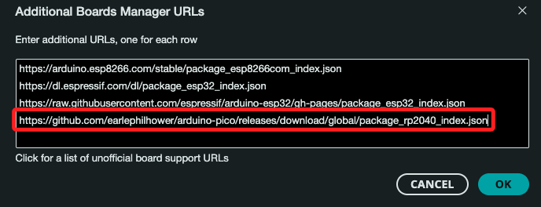
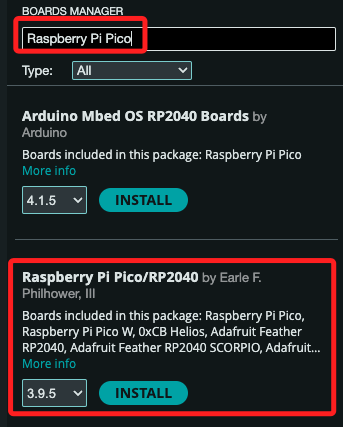
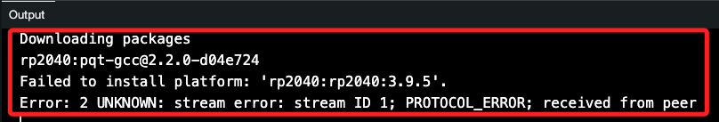
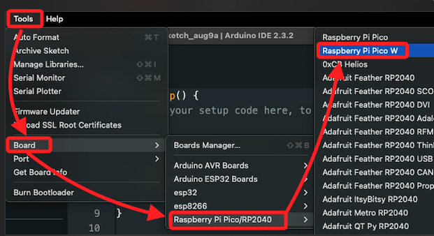
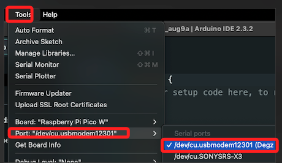
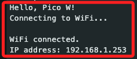

# Arduino IDE 開發 Pico W

<br>

## 添加 Raspberry Pi Pico

1. 啟動 Arduino IDE，打開 `Preferences`。

<br>

2. 展開 `額外開發版 URLs`，添加以下 URL。

    ```bash
    https://github.com/earlephilhower/arduino-pico/releases/download/global/package_rp2040_index.json
    ```

    

<br>

3. 打開 `開發板管理員`，搜尋並安裝 `Raspberry Pi Pico`。

    

<br>

## 錯誤排除

1. 假如出現如下的錯誤，再次點擊 `INSTALL` 即可。

    

<br>

## 開發

1. 把開發板接上電腦，在 IDE 中選擇板卡：`Tools -> Board -> Raspberry Pi Pico -> Raspberry Pi Pico W`。

    

<br>

2. 選擇端口：`Tools -> Port`。

    

<br>

3. 以下範例將進行聯網測試。

    ```cpp
    #include <WiFi.h>

    // 輸入自己的 Wi-Fi 資訊
    const char* ssid = "SamHome2.4g";
    const char* password = "sam112233";

    void setup() {
    Serial.begin(115200);
    while (!Serial) {
        delay(50);
    }
    //
    Serial.println("Serial OK.");
    // 開始連接 Wi-Fi
    Serial.println("Connecting to WiFi...");
    WiFi.begin(ssid, password);

    while (WiFi.status() != WL_CONNECTED) {
        delay(100);
        Serial.print(".");
    }

    // Wi-Fi 連接成功
    Serial.println("");
    Serial.println("WiFi connected.");
    Serial.print("IP address: ");
    Serial.println(WiFi.localIP());
    }

    void loop() {
    //
    }
    ```

<br>

4. 上傳程式。

    

<br>

___

_END_